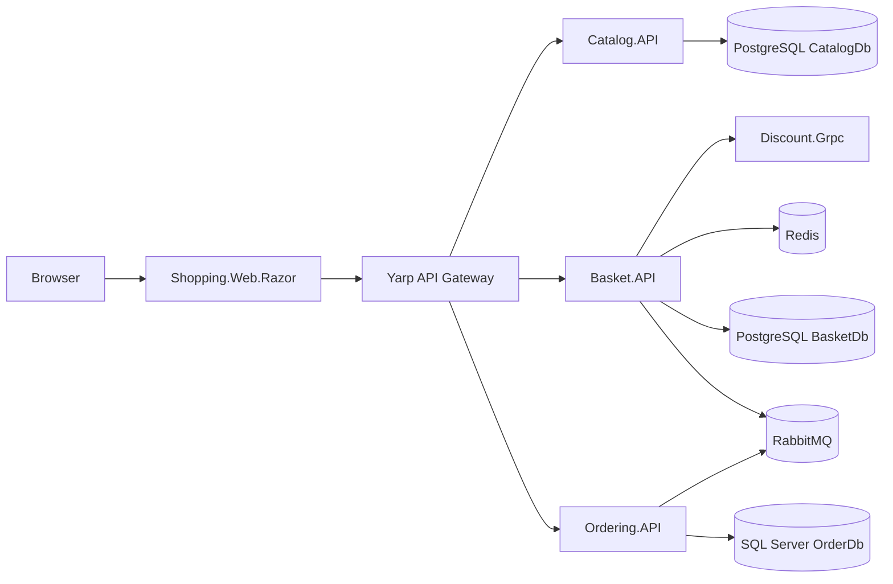

# eShop Microservices (src)

This folder contains the .NET 10 microservices solution for the eShop sample, including backend services, API gateway, shared building blocks, and a Razor web frontend.

## Solution at a glance

- Framework: ASP.NET Core / .NET 10
- API style: Minimal APIs, gRPC, and YARP reverse proxy
- Messaging: RabbitMQ (MassTransit + Wolverine)
- Data stores: PostgreSQL, SQL Server, Redis, SQLite (Discount service)
- Frontend: Razor web app
- Container orchestration: Docker Compose

## Project structure

```text
src/
├── APIGateways/
│   └── YarpApiGateway/
├── BuildingBlocks/
│   ├── BuildingBlocks/
│   └── BuildingBlocks.Messaging/
├── Services/
│   ├── Basket/
│   │   └── Basket.API/
│   ├── Catalog/
│   │   └── Catalog.API/
│   ├── Discount/
│   │   └── Discount.Grpc/
│   └── Ordering/
│       ├── Ordering.API/
│       ├── Ordering.Application/
│       ├── Ordering.Core/
│       └── Ordering.Infrastructure/
├── WebApps/
│   └── Shopping.Web.Razor/
├── docker-compose.yml
├── docker-compose.override.yml
└── eshop-microservices.slnx
```

## Runtime architecture



## Services and ports

### App containers (Docker Compose)

| Component | Internal port(s) | Host port(s) |
|---|---:|---:|
| Catalog.API | 8080 / 8081 | 6000 / 6060 |
| Basket.API | 8080 / 8081 | 6001 / 6061 |
| Discount.Grpc | 8080 / 8081 | 6002 / 6062 |
| Ordering.API | 8080 / 8081 | 6003 / 6063 |
| YarpApiGateway | 8080 / 8081 | 6004 / 6064 |
| Shopping.Web.Razor | 8080 / 8081 | 6005 / 6065 |

### Infrastructure containers

| Component | Host port(s) |
|---|---:|
| PostgreSQL (Catalog) | 5432 |
| PostgreSQL (Basket) | 5433 |
| Redis | 6379 |
| SQL Server (Ordering) | 1433 |
| RabbitMQ | 5672 |
| RabbitMQ Management UI | 15672 |

## Prerequisites

- .NET 10 SDK
- Docker Desktop
- Git

Optional (recommended for local HTTPS development):

```bash
dotnet dev-certs https --trust
```

## Quick start (recommended)

Run everything with Docker Compose.

```bash
cd src
docker compose up --build
```

Then open:

- Shopping web app: http://localhost:6005
- API gateway: http://localhost:6004
- RabbitMQ management: http://localhost:15672 (guest / guest)

Stop and clean:

```bash
docker compose down
```

Stop and clean volumes too:

```bash
docker compose down -v
```

## Run without Docker (service-by-service)

You can run services individually using project launch profiles.

```bash
# Example: Catalog API
cd src/Services/Catalog/Catalog.API
dotnet run
```

Default local development URLs:

- Catalog.API: http://localhost:5000
- Basket.API: http://localhost:5001
- Discount.Grpc: http://localhost:5002
- Ordering.API: http://localhost:5003
- YarpApiGateway: http://localhost:5004
- Shopping.Web.Razor: http://localhost:5005

When running this way, ensure required dependencies (databases, cache, broker) are available.

## Build the solution

```bash
cd src
dotnet restore eshop-microservices.slnx
dotnet build eshop-microservices.slnx
```

## Key documentation by service

- Catalog API: Services/Catalog/Catalog.API/README.md
- Basket API: Services/Basket/Basket.API/README.md
- Discount gRPC: Services/Discount/Discount.Grpc/README.md
- Ordering Infrastructure: Services/Ordering/Ordering.Infrastructure/README.md

## Notes

- Shared exception handling lives in BuildingBlocks and is used across services.
- Compose uses development credentials and settings intended for local development only.
